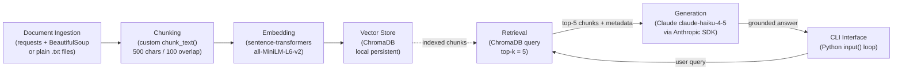

# Project 1 Planning: The Unofficial Guide

> Write this document before you write any pipeline code.
> Your spec and architecture diagram are what you'll use to direct AI tools (Claude, Copilot, etc.) to generate your implementation — the more specific they are, the more useful the generated code will be.
> Update the Retrieval Approach and Chunking Strategy sections if you change your approach during implementation.
> Update this file before starting any stretch features.

---

## Domain

Off-campus housing in Gainesville, FL for University of Florida students. This knowledge is hard to find through official channels because UF's housing office only covers on-campus options, while the real student experience — which complexes have mold problems, which landlords ignore maintenance requests, which neighborhoods flood, and what a fair price looks like — lives scattered across Reddit threads, Yelp reviews, ApartmentRatings posts, and word of mouth. A student trying to lease their first apartment has no single place to compare neighborhoods, bus access, price ranges, and landlord reputation at once.

---

## Documents

<!-- List your specific sources: URLs, subreddit names, forum threads, or file descriptions.
     Aim for at least 10 sources that together cover different subtopics or perspectives within your domain. -->

| # | Source | Description | URL or location |
|---|--------|-------------|-----------------|
| 1 | UF Off Campus Life — Housing Resources | Official UF off-campus housing portal with listings, tenant rights info, and neighborhood guides | https://offcampus.ufl.edu/resources/off-campus-housing/ |
| 2 | Off Campus Universe — UF Housing Guide | Comprehensive student-written guide covering neighborhoods, pricing, and lease tips for Gainesville | https://www.offcampus-universe.com/post/student-apartments-gainesville-fl-where-to-live-off-campus-at-uf |
| 3 | Sweetwater Gainesville — Best Student Apartments Guide | Ranked list of top student apartment complexes near UF with amenity comparisons and pricing tiers | https://sweetwatergainesville.com/resources/best-student-apartments-uf-gainesville/ |
| 4 | Sweetwater Gainesville — Freshman Housing Guide | Advice for first-year students navigating on-campus vs off-campus decisions, updated for 2026 | https://sweetwatergainesville.com/resources/freshman-uf-housing/ |
| 5 | prked.com — Ultimate UF Off-Campus Housing Guide | Detailed guide covering neighborhoods, Archer Road corridor, lease timing, and commute options | https://prked.com/post/the-ultimate-university-of-florida-off-campus-housing-guide |
| 6 | Off Campus Universe — UF Off-Campus Housing Guide | Covers RTS bus routes, neighborhood safety, and walkability for UF students | https://www.offcampus-universe.com/post/uf-off-campus-housing-guide-for-students-in-gainesville |
| 7 | Swamp Rentals — Apartments on Bus Routes | Lists Gainesville apartments served by RTS campus bus routes with route numbers | https://www.swamprentals.com/uf-parent-guide/apartments-in-gainesville-on-bus-route |
| 8 | UF TAPS — Transportation & Parking | Official UF commuter and transit resource explaining the free RTS bus benefit for students | https://offcampus.ufl.edu/resources/transportation/ |
| 9 | ApartmentRatings — Gainesville Place Apartments | Tenant reviews of a major student complex covering maintenance, staff, and living conditions | https://www.apartmentratings.com/fl/gainesville/gainesville-place-apartments_352271313132608/ |
| 10 | Yelp — Student Apartments Gainesville FL | Aggregated student reviews of multiple Gainesville apartment complexes | https://www.yelp.com/search?find_desc=Student+Apartments&find_loc=Gainesville,+FL |
| 11 | Yelp — UF Apartments Gainesville FL | Broader Yelp apartment search for UF-area complexes with ratings and reviews | https://www.yelp.com/search?find_desc=Uf+Apartments&find_loc=Gainesville%2C+FL |
| 12 | ForRentUniversity — UF Off-Campus Housing | Aggregator listing apartments near UF with pricing, photos, and availability filters | https://www.forrentuniversity.com/University-of-Florida |
| 13 | Quora — Best Areas in Gainesville for UF Students | Community Q&A covering neighborhood comparisons from current and former UF students | https://www.quora.com/What-areas-of-Gainsville-are-the-most-pleasant-to-live-for-a-UF-student |
| 14 | UF PHHP — Living in Gainesville | Graduate student-focused housing and neighborhood guide from UF's College of Public Health | https://phhp.ufl.edu/admissions/living-in-gainesville/ |
| 15 | Stoneridge Apartments | Large 366-unit complex at 3800 SW 34th St; popular with Indian community, 2–3 BR units, close to UF and Santa Fe College | https://www.stoneridgegainesville.com/ |
| 16 | Centric on 34th Apartments | 119-unit community at SW 39th Blvd off 34th St; 2–3 BR, in-unit laundry, near Butler Plaza; popular with Indian graduate students | https://centricaptsgainesville.com/ |
| 17 | The Quarters Gainesville | Large student complex at 4000 SW 37th Blvd near 34th St; 3–4 BR furnished units, pool, study labs, 10-min bus to UF | https://thequartersgainesville.com/ |
| 18 | Greenwich Green Apartments | Complex on SW 39th Blvd near 34th St corridor; 1–3 BR, on-site RTS bus stop, tennis/basketball courts, ~2 miles from UF | https://www.greenwichgreen.net/ |

---

## Chunking Strategy

**Chunk size:** 500 characters

**Overlap:** 100 characters

**Reasoning:**
The corpus is a mix of two document types. Short Yelp and ApartmentRatings reviews are typically 1–4 sentences (100–400 characters), so a 500-character chunk keeps most reviews whole rather than splitting them mid-opinion. Long student guides (prked.com, Sweetwater, Off Campus Universe) run several paragraphs; 500 characters breaks these into roughly one tight topic per chunk (e.g., one chunk covers bus routes, the next covers pricing), which maps well to the narrow factual questions users will ask.

The 100-character overlap handles the boundary problem: if a review says "maintenance took three weeks" at the end of one chunk and names the complex at the start of the next, the overlap ensures at least one of those chunks carries both pieces together, making it retrievable for a query like "Stoneridge maintenance issues."

If chunks were too small (e.g., 150 chars), a single review sentence might not carry enough context to score highly against a semantically rich query. If chunks were too large (e.g., 2000 chars), a chunk mixing five different topics would retrieve for queries it only partially answers, flooding the LLM with noise and burying the relevant sentence.

---

## Retrieval Approach

**Embedding model:** `all-MiniLM-L6-v2` via `sentence-transformers`

**Top-k:** 5

**Reasoning for top-k:**
Retrieving 5 chunks gives the LLM enough evidence to synthesize a grounded answer (e.g., multiple reviews about the same complex) without exceeding a reasonable context budget. Fewer than 3 risks missing a relevant chunk when two chunks share similar cosine scores; more than 8 starts injecting off-topic chunks that confuse generation.

Semantic search works here even when a query uses different words than the document because the embedding model maps both to nearby points in vector space based on meaning — a query like "which apartments have bad management" will surface chunks containing "unresponsive office staff" or "ignored maintenance tickets" because those phrases cluster semantically with "bad management."

**Production tradeoff reflection:**
In production with no cost constraint I would evaluate `text-embedding-3-large` (OpenAI) or `e5-large-v2`. Key tradeoffs:
- **Accuracy on domain-specific text:** MiniLM was trained on general web text; a model fine-tuned on real estate or student reviews would score closer semantic matches for phrases like "lease buyout" or "RTS Route 75."
- **Context length:** MiniLM handles 256 tokens max; longer chunks would be truncated. `e5-large` supports 512 tokens, which matters if I increase chunk size later.
- **Latency:** MiniLM runs locally in ~5ms/chunk; larger cloud models add network round-trips, which matters for interactive queries.
- **Multilingual support:** Not a priority here — corpus and users are English-only — but would matter if the system expanded to serve international students searching in their native language.

---

## Evaluation Plan

| # | Question | Expected answer |
|---|----------|-----------------|
| 1 | What RTS bus routes serve apartments on the SW 34th Street corridor? | Routes 1, 9, 12, 34, 35, 38, and 75 serve the Archer Road / 34th Street corridor; students with a UF ID ride free. |
| 2 | What do residents say about maintenance response times at Stoneridge Apartments? | Reviews note slow or inconsistent maintenance response; the complex is older (built 1977) and some tenants report delays of days to weeks for repairs. |
| 3 | When should UF students start apartment hunting to secure a unit for the following fall semester? | The best student apartments near UF lease out between February and May; students should begin searching no later than February to avoid missing availability. |
| 4 | What is the typical monthly rent range for a room in a 4-bedroom apartment near UF's campus? | Roughly $690–$1,100/month per room depending on distance to campus, typically all-inclusive (rent + utilities + internet). |
| 5 | Which neighborhoods in Gainesville are walkable to UF without a car or bus? | The stretch along SW Archer Road and SW 2nd Avenue immediately south of campus is the most walkable; Midtown (between campus and downtown) is a 15–20 minute walk. Complexes further south on 34th Street (Stoneridge, Greenwich Green) require a bus or bike. |

---

## Anticipated Challenges

1. **Vague or emotionally-charged review text produces low-precision chunks.** Yelp and ApartmentRatings reviews like "this place is a nightmare, do not move here" carry strong sentiment but no actionable facts. When a user asks "what are the pros and cons of Stoneridge?", these chunks will score high in retrieval but give the LLM nothing concrete to cite — the generated answer may sound confident while being nearly content-free. Mitigation: during ingestion, flag or filter chunks shorter than 80 characters or containing no nouns, so they don't dilute retrieval results.

2. **Key facts split across chunk boundaries reduce retrievability.** Long guides often state an apartment's name in one sentence and its price or bus route in the next. If those sentences fall in adjacent chunks without overlap, a query about "Centric on 34th rent" may retrieve a chunk that has the price but not the name — or the name but not the price. The 100-character overlap reduces this risk, but paragraph-boundary chunking (splitting only at `\n\n`) would be more robust for the guide documents. This is worth revisiting in Milestone 3 if early retrieval tests show name/price mismatches.

3. **Off-topic retrieval from aggregator pages.** Sources like ForRentUniversity and Apartments.com listing pages contain boilerplate marketing copy ("pet-friendly community with resort-style amenities") that embeds very close to generic queries. A question like "which apartments allow pets?" may retrieve six nearly identical boilerplate chunks instead of real student opinions. Mitigation: store source metadata with each chunk and, during evaluation, check whether retrieved chunks are from review sources vs. listing pages.

---

## Architecture

**Stage details:**
- **Ingestion:** Raw HTML fetched with `requests`, stripped with `BeautifulSoup`. Plain `.txt` files read directly. Each document saved with source URL as metadata.
- **Chunking:** `chunk_text(text, size=500, overlap=100)` — character-based sliding window. Returns list of `{"text": ..., "source": ...}` dicts.
- **Embedding:** `SentenceTransformer("all-MiniLM-L6-v2").encode()` called on each chunk. Runs locally, no API key needed.
- **Vector Store:** ChromaDB persistent collection stored in `./chroma_db/`. Each chunk stored with embedding + source URL metadata.
- **Retrieval:** `collection.query(query_embeddings=[...], n_results=5)` returns top-5 chunks by cosine similarity.
- **Generation:** Retrieved chunks injected into a system prompt as context. Claude generates a grounded answer citing sources. Model: `claude-haiku-4-5-20251001`.
- **Interface:** Simple `while True` input loop in `main.py`. User types a question, system prints the answer, loop repeats until "quit".

---

## AI Tool Plan

**Milestone 3 — Ingestion and chunking:**
I will give Claude the **Chunking Strategy** section and the **Architecture** stage detail for ingestion, then ask it to implement two functions: `load_documents(doc_list)` that fetches and parses each URL using `requests` + `BeautifulSoup` and returns a list of `{"text": str, "source": str}` dicts, and `chunk_text(text, size=500, overlap=100)` that applies a character-based sliding window. I'll verify the output by asserting that chunks from a known short review (< 500 chars) come back as a single chunk, and that a 1200-character guide passage produces three overlapping chunks of the right length.

**Milestone 4 — Embedding and retrieval:**
I will give Claude the **Retrieval Approach** section and the Architecture diagram, then ask it to implement `embed_and_store(chunks)` (uses `sentence-transformers` to embed each chunk and upserts into a ChromaDB persistent collection) and `retrieve(query, k=5)` (embeds the query string and calls `collection.query()`). I'll verify by running `retrieve("bus routes near 34th street")` and manually checking that the top results reference RTS routes or 34th Street apartments from our document set — not unrelated content.

**Milestone 5 — Generation and interface:**
I will give Claude the full `planning.md` (Domain + Architecture + Retrieval Approach sections), the Anthropic SDK docs for basic `messages.create()` usage, and ask it to implement `generate_answer(query, chunks)` that builds a system prompt with the retrieved chunks as context and calls the Claude API, plus a `main()` CLI loop. I'll verify against the 5 evaluation questions in the Evaluation Plan, checking that each answer mentions at least one specific fact traceable to a retrieved source chunk.
